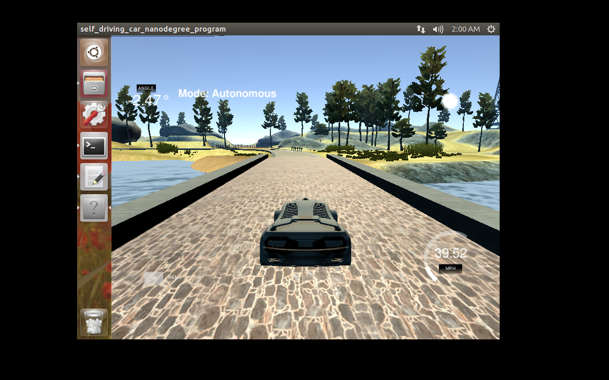

# PID控制器
Self-Driving Car Engineer Nanodegree Program

---

代码的运行环境与运行方式与Term2的大同小异，不再赘述，可参考[Project 3][https://github.com/hapuhundre/particle_filter]

使用PID控制器让小车安全的跑起来，越快越好。小车的速度在30迈到100迈之间。

行驶的视频参见video文件夹下mp4文件

PID results can be found in the mp4 file under the `video` folder

## PID Tuning

使用“twiddle”方法+手工调参(Manual adjustment )对三个系数Kp、Ki以及Kd进行调参，twiddle实现过程参见`PID.cpp`文件中的`Tunning`函数，但在tuning过程中，twiddle方法车辆的形式过程并不稳定,因此手工调整参数是有必要的。

## Tips

PID控制器的实现较为简单，课程的Python版本在cpp中实现也没什么难度。

* throttle的问题

  当将throttle value设为恒定值0.3~0.5时，小车运动的稳定性比用PID控制要强不少。当throttle value为pid控制时，小车两边摇晃，显然不够安全，也限制了小车的速度。

* steer初始参数的设置

  Init的三个系数Kp、Kd以及Ki在运动学上的含义。

